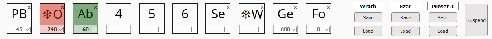

# Arcanum Userscript

Tempermonkey / Greasemonkey userscript for the idle game Arcanum (Theory of Magic on Kongregate)

The main focus of this set of scripts is minor covenience features. It is not meant as a full automation.

If you want something more wholesome head over to [arcanum-automation](https://github.com/mettalogic/arcanum-automation/)

This is tested on 1920x1080 resolution and using the normal theme, it may not work properly on other layouts / browsers / themes.

### Provides the following Features

#### Quickslot automation

- similar to [arcanum-automation](https://github.com/mettalogic/arcanum-automation/) script
- Can be enabled / disabled for each slot and globally suspended
- 3 Presets can be saved and loaded anytime which persist timings and enabled state (does not persist the selected action)

    

#### Resource Screen Coloring

- Colors based on amount of resources
- red if 0, orange if <= 10%
- green if full, yellow-green if >= 90%

    
 
#### Top bar Buff Layout

- Fixed the width and height and made the title wrap so they don't overlap
- buffs with less than 10 seconds remaining will show the time in red

    
    
#### Main Screen

- Permanent Upgrades have a pink background
- Class Upgrades have a green background
- CTRL+Click on single click action will lock them and execute them at a fixed interval (~250ms)
- Added alternative grouped task display

    
    
    
    
- Added imbue all gems button which shows up as soon as you have some imbue actions, this will trigger all available imbue options in one click
- Ctrl+Click will lock the button same as single click actions

    
    
#### Potion Screen Adjusted

- Buttons color based on action
- spacing of elements increased

    

#### Enchanting Screen Adjusted

- Potions are no longer shown
- Enchanted items are colored purple and have italic font
- Enchanting list now shows the level of the enchant
- Enchanting list can be shown grouped by equipment slot with the enchants sorted by name
- Enchants that exceed the available slot levels are colored red
- spacing of elements increased to make room for long names
- 'Enchanted' stripped from the name since coloring makes it clear

        
    
#### Bestiary Screen Adjusted

- Underline removed from creature names
- Hand cursor removed when mousing over creature names since it confuses as click action

    
    
#### Equip Screen Adjusted

- Enchanted items are colored purple and have italic font
- All items show their level
- Special items are colored golden
- consumables are colored blue
- spacing of elements increased to make room for long names
- 'Enchanted' stripped from the name since coloring makes it clear
- items that have a higher level than currently equipped show a 👍 symbol
- items that are lower than currently equpped show a 🔻 symbol

    
    
#### Home Screen Adjusted

- Home selection now shows the size in braces

    
    
#### Player Screen Adjusted

- Mount selection now shows the distance in braces

    
    
#### Adventure Screen Adjusted

- All items show their level
- spacing of elements increased to avoid layout shifting
- removed equip buttons since they are not so useful here
- Item tooltips show currently equipped item

    
     
- Buffs now have fixed width + height making them easier to see and no longer overlap
- Curse debuffs now have a violet background color
    
    
    
- Added a Damage Meter that shows different statistics

    
    
#### Skills Screen Adjusted

- spacing of elements increased to avoid layout shifting

    
    
#### Save file Fixing

__BACKUP YOUR SAVE BEFORE USING THIS__
- Added buttons to check and fix a save file
- Fix broken enchantments and item names

    
    
- To see the results of check file check the console window in your browser

    

## Getting Started

Click on us.js and Tempermonkey should automatically bring up a dialog to install the script

### Usage

## Contributing

Please read [CONTRIBUTING.md](CONTRIBUTING.md) for details on our code of conduct, and the process for submitting pull requests to us.

## License

This project is licensed under the MIT License - see the [LICENSE.md](LICENSE.md) file for details
