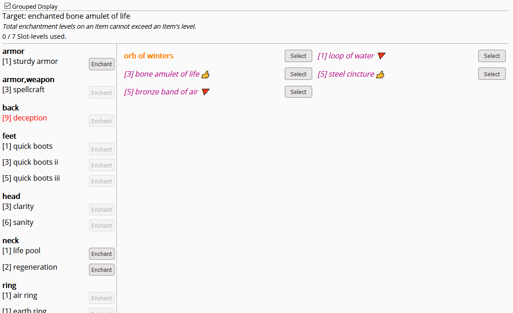
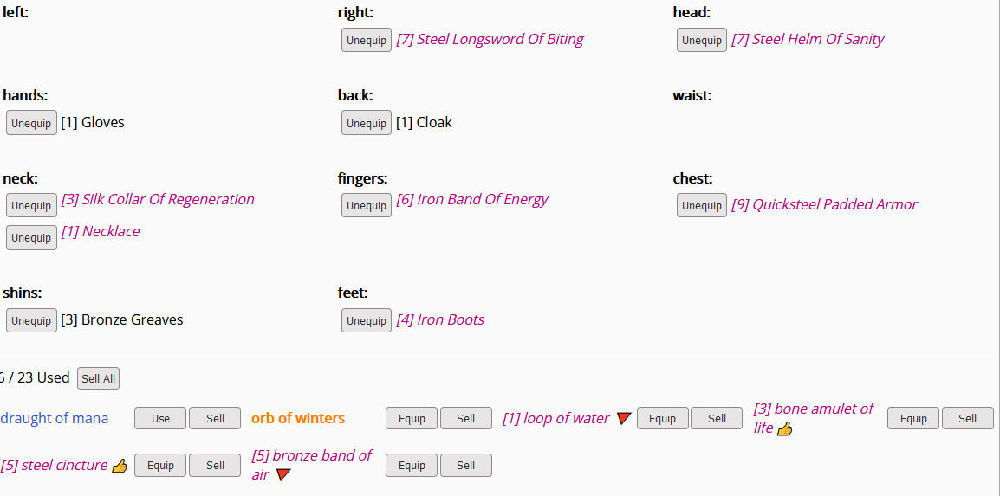
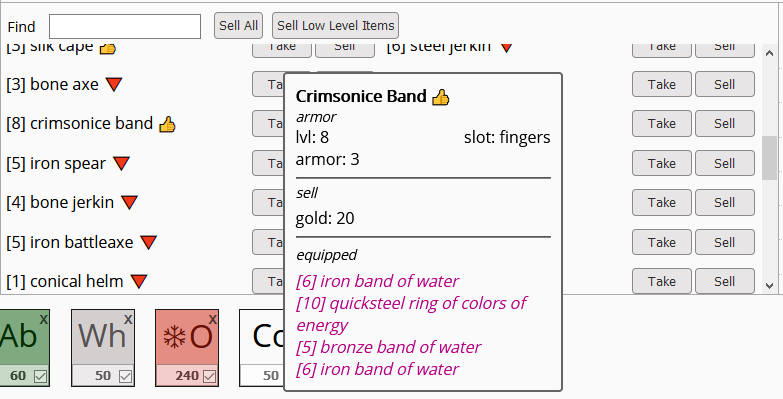

# Arcanum Userscript

Tempermonkey / Greasemonkey userscript for the idle game Arcanum (Theory of Magic on Kongregate)

The main focus of this set of scripts is minor covenience features. It is not meant as a full automation.

If you want something more wholesome head over to [arcanum-automation](https://github.com/mettalogic/arcanum-automation/)

This is tested on 1920x1080 resolution and using the normal theme, it may not work properly on other layouts / browsers / themes.

### Provides the following Features

#### Quickslot automation

- similar to [arcanum-automation](https://github.com/mettalogic/arcanum-automation/) script

    

#### Resource Screen Coloring

- Colors based on amount of resources
- red if 0, orange if <= 10%
- green if full, yellow-green if >= 90%

    
 
    
#### Potion Screen Adjusted

- Buttons color based on action
- spacing of elements increased

    

#### Enchanting Screen Adjusted

- Potions are no longer shown
- Enchanted items are colored purple and have italic font
- All items show their level
- Special items are colored blue
- spacing of elements increased to make room for long names
- 'Enchanted' stripped from the name since coloring makes it clear

    
    
    
#### Bestiary Screen Adjusted

- Underline removed from creature names
- Hand cursor removed when mousing over creature names since it confuses as click action

    
    
#### Equip Screen Adjusted

- Enchanted items are colored purple and have italic font
- All items show their level
- Special items are colored blue
- spacing of elements increased to make room for long names
- 'Enchanted' stripped from the name since coloring makes it clear

    
    
#### Adventure Screen Adjusted

- All items show their level
- spacing of elements increased to avoid layout shifting
- removed equip buttons since they are not so useful here

     
    
#### Skills Screen Adjusted

- spacing of elements increased to avoid layout shifting

    

## Getting Started

Click on us.js and Tempermonkey should automatically bring up a dialog to install the script

### Usage

## Contributing

Please read [CONTRIBUTING.md](CONTRIBUTING.md) for details on our code of conduct, and the process for submitting pull requests to us.

## License

This project is licensed under the MIT License - see the [LICENSE.md](LICENSE.md) file for details
